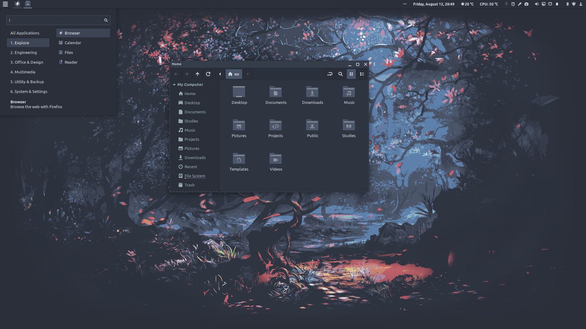
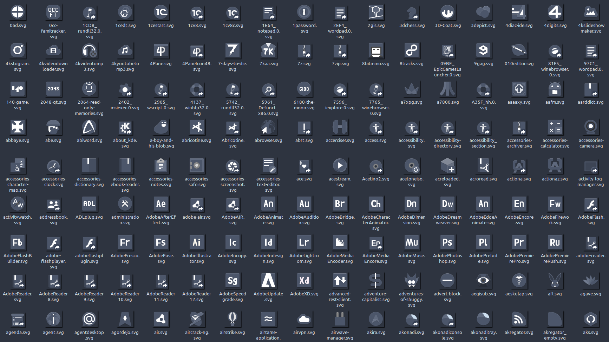
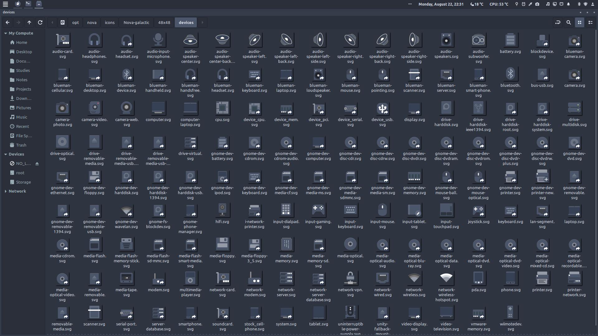
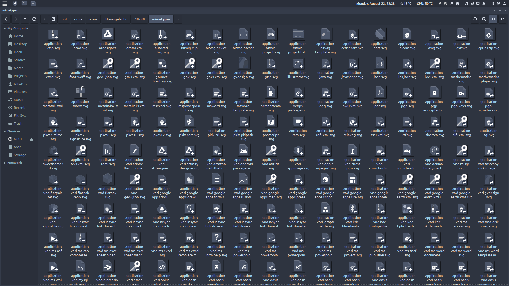

# Nova-galactic-icons
Features 5000+ monochromatic* icons following the Nord color palette. It is a recolor and simplification of the Papirus icons. Every icon is an SVG, meaning they will be sharp at every size and resolution, and take up very little space.

It was created for Nova-OS, a spin on the brilliant Linux Mint, on which I am currently working.

*Icon indicators, such as warnings and errors, follow appropriate color conventions, but adjusted to fit the nord palette.

## Preview
Folders

Applications

Devices

Mimes

